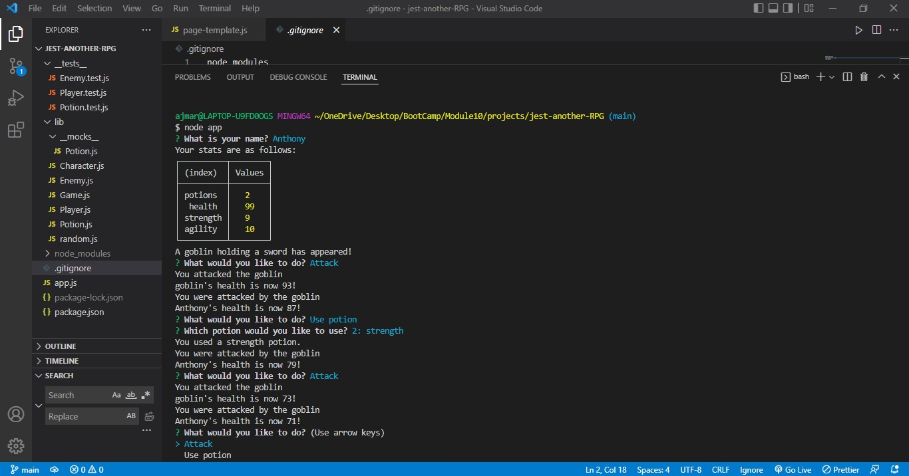

# Jest Another RPG

## Table of Contents
* [Description](#description)
* [Technologies Used](#technologies-used)
* [Installation](#installation)
* [Usage](#usage)
* [Contributing](#contributing)
* [Images](#images)
* [Questions](#questions)

### Description
A console-based game that uses JavaScript, Node, OOP and Inquirer that allows you to fight monsters and use potions to win the game!

### Technologies Used
* JavaScript
* Node.js
* TDD
* OOP
* Inquirer.js

### Installation
1. Clone repository using `git@github.com:ajmarrocco/jest-another-RPG.git`
2. Type `npm i` or `npm install` to install all dependencies
3. Type `node app` to start the game!

### Usage 
All dependencies must be installed prior to using application

### Contributing 
Pull requests are reviewed

### Images

### Questions
If you have any questions about opening an issue or the repository itself, please contact me at ajmarrocco@gmail.com. Please visit https://github.com/ajmarrocco for more of my projects!